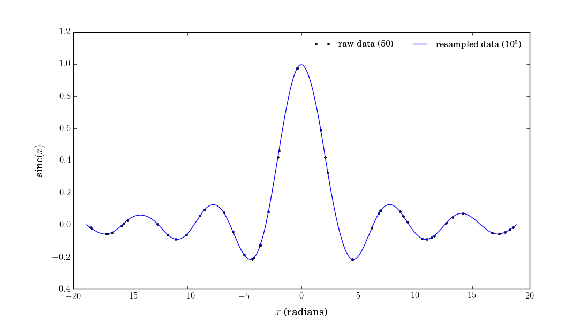

Cubic Spline Library
====================

This small C++ library contains my working code for performing
natural cubic spline interpolation in one, two, and three
dimensions.

**dependencies:** OpenMP (omp.h)

The CubicSpline class is fully functional. A test program is
available in *CubicSpineTest.cc*, the results of which I
have plotted in *CubicSplineTest.pdf* using Python.



BiCubicSpline and TriCubicSpline are still being developed.
Documentation and usage will be provided in the future.

##Building

You should be able to just run 'make'. This compiles and links
the programs. The user will either need to make this available
on their standard include path or link to this directory.

I recommend something like:
```
export CSLDIR=/path/to/CubicSplineLib
export CSLINC="-I$CSLDIR -L$CSLDIR -lCubicSpline -fopenmp"
```
After which, programs can be compiled similar to:
```bash
g++ your_program.cc $CSLINC
```

##Short Example Usage
```C++
// create spline object
CubicSpline<double> raw_data( x, y, 2 );

// resample 'x' data 
std::vector<double> new_y = raw_data.interpolate( new_x );
```

The user can construct the spline object with float, 
double, or long double types. The third argument in
the constructor is optional and has a default value
of one. This says what the maximum allowed threads
should be for OpenMP. There is a fourth optional argument
that takes either true or false. By default this
implementation uses a quicksort algorithm to ensure
the horizontal axis is in ascending order before 
building the spline polynomials. This behavior can
be supressed by specifying false. Also, in the 
interpolation function, an optional second and third
argument taking either true or false and a numeric
type the same as the template respectively allow
for returning fixed values outside the domain of the
original data.

e.g.,
```C++
raw_data.interpolate( new_x, true, 0.0 );
```
would return a std::vector containing 0.0 for all positions
outside the original domain of 'x'.


